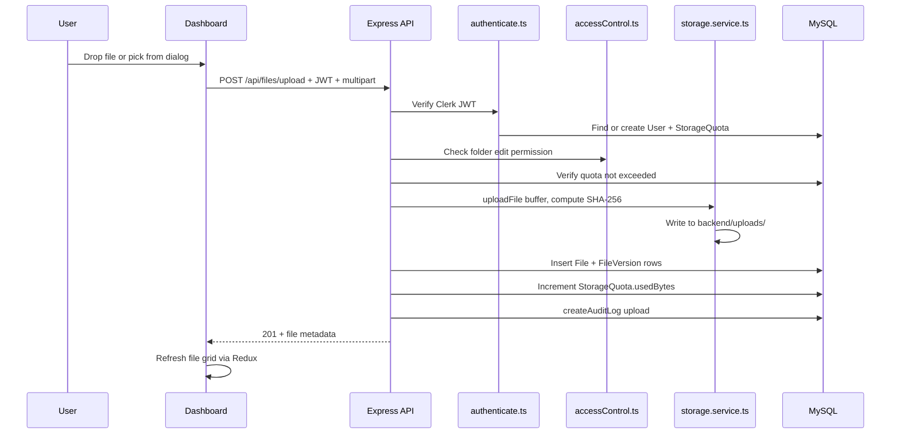
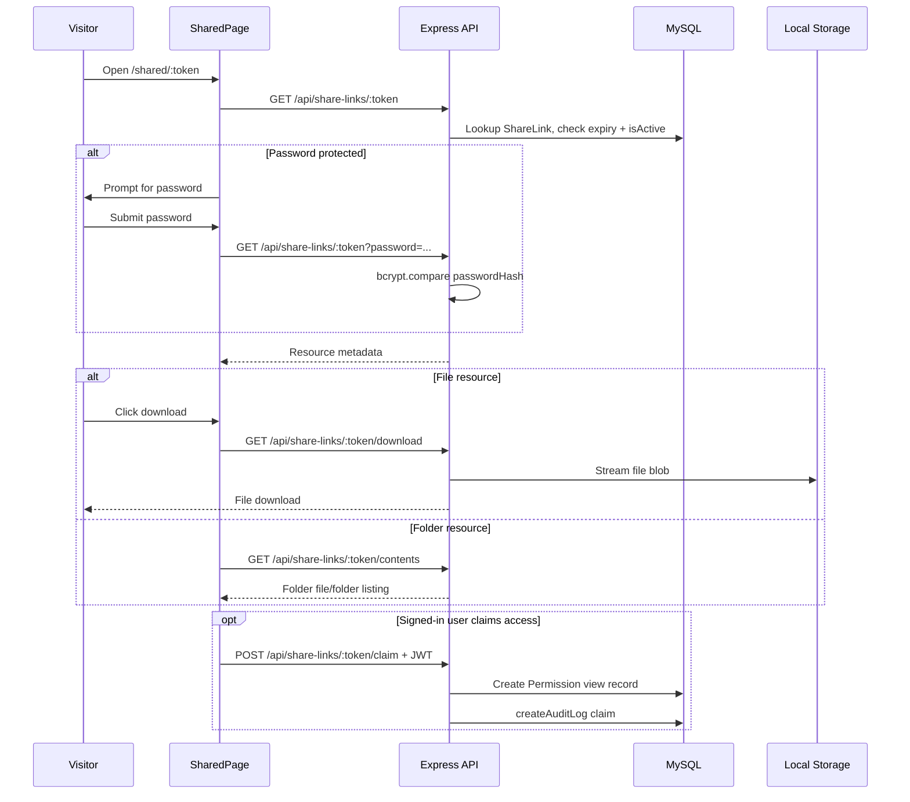
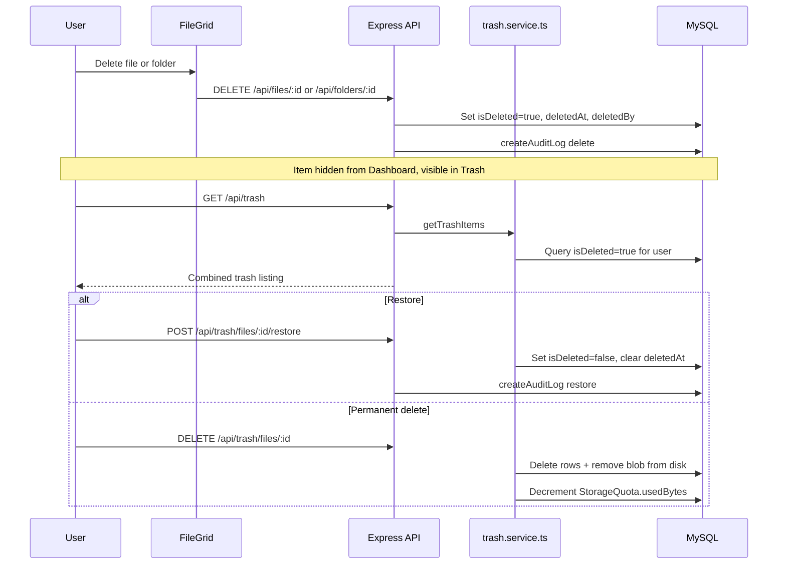
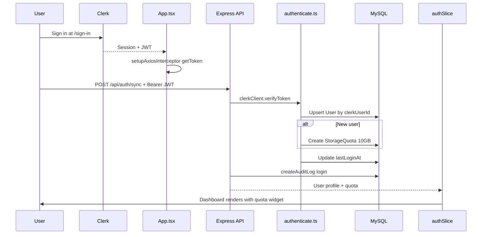

# Secure Cloud System — Workflow and File Reference

This document describes end-to-end request flows, API routing, and the purpose of every meaningful file in the repository. For a high-level overview and setup instructions, see [README.md](README.md).

---

## 1. System Overview — Core Flows

### 1.1 File Upload



**Frontend entry:** [`frontend/src/pages/Dashboard.tsx`](frontend/src/pages/Dashboard.tsx) → [`frontend/src/services/fileService.ts`](frontend/src/services/fileService.ts)  
**Backend handler:** [`backend/src/modules/files/file.controller.ts`](backend/src/modules/files/file.controller.ts)

---

### 1.2 Public Share Link Access



**Frontend entry:** [`frontend/src/pages/SharedPage.tsx`](frontend/src/pages/SharedPage.tsx)  
**Backend handler:** [`backend/src/modules/share-links/shareLink.controller.ts`](backend/src/modules/share-links/shareLink.controller.ts)

After sign-in, [`frontend/src/pages/Dashboard.tsx`](frontend/src/pages/Dashboard.tsx) reads `pendingShareToken` from `localStorage` and calls the claim endpoint automatically.

---

### 1.3 Soft Delete, Trash, and Restore



Trash can also be managed via file/folder module endpoints (`PATCH /api/files/:id/restore`, `GET /api/files/trash`) in addition to the dedicated trash module.

---

### 1.4 Authentication and User Sync



---

## 2. Backend Request Routing Map

All routes are mounted in [`backend/src/index.ts`](backend/src/index.ts). Base prefix: `/api`.

| Mount | Router | Controller | Key DB Models |
|-------|--------|------------|---------------|
| `/api/auth` | [`auth.router.ts`](backend/src/modules/auth/auth.router.ts) | [`auth.controller.ts`](backend/src/modules/auth/auth.controller.ts) | `User`, `StorageQuota`, `AuditLog` |
| `/api/files` | [`file.router.ts`](backend/src/modules/files/file.router.ts) | [`file.controller.ts`](backend/src/modules/files/file.controller.ts) | `File`, `FileVersion`, `StorageQuota`, `AuditLog` |
| `/api/folders` | [`folder.router.ts`](backend/src/modules/folders/folder.router.ts) | [`folder.controller.ts`](backend/src/modules/folders/folder.controller.ts) | `Folder`, `AuditLog` |
| `/api/permissions` | [`permission.router.ts`](backend/src/modules/permissions/permission.router.ts) | [`permission.controller.ts`](backend/src/modules/permissions/permission.controller.ts) | `Permission`, `AuditLog` |
| `/api/share-links` | [`shareLink.router.ts`](backend/src/modules/share-links/shareLink.router.ts) | [`shareLink.controller.ts`](backend/src/modules/share-links/shareLink.controller.ts) | `ShareLink`, `Permission`, `AuditLog` |
| `/api/tags` | [`tag.router.ts`](backend/src/modules/tags/tag.router.ts) | [`tag.controller.ts`](backend/src/modules/tags/tag.controller.ts) | `Tag` |
| `/api/trash` | [`trash.router.ts`](backend/src/modules/trash/trash.router.ts) | [`trash.controller.ts`](backend/src/modules/trash/trash.controller.ts) + [`trash.service.ts`](backend/src/modules/trash/trash.service.ts) | `File`, `Folder`, `StorageQuota` |
| `/api/search` | [`search.router.ts`](backend/src/modules/search/search.router.ts) | [`search.controller.ts`](backend/src/modules/search/search.controller.ts) | `File`, `Folder`, `Tag`, `Permission` |
| `/api/audit-logs` | [`audit.router.ts`](backend/src/modules/audit-logs/audit.router.ts) | [`audit.controller.ts`](backend/src/modules/audit-logs/audit.controller.ts) | `AuditLog` |
| `/api/admin` | [`admin.router.ts`](backend/src/modules/admin/admin.router.ts) | [`admin.controller.ts`](backend/src/modules/admin/admin.controller.ts) | `User`, `StorageQuota`, `AuditLog` |
| `/api/health` | inline in `index.ts` | — | — |
| `/uploads/*` | static (when `USE_LOCAL_STORAGE=true`) | — | disk blobs |

### 2.1 Complete Endpoint Reference

#### Auth — `/api/auth` (authenticated)

| Method | Path | Handler | Purpose |
|--------|------|---------|---------|
| POST | `/sync` | `syncUser` | Upsert user, provision quota, audit login |
| GET | `/me` | `getMe` | Current user profile + quota |

#### Files — `/api/files` (authenticated)

| Method | Path | Purpose |
|--------|------|---------|
| POST | `/upload` | Upload file (500 MB max, multipart field `file`) |
| GET | `/` | List files in folder (`?folderId=`) |
| GET | `/trash` | List soft-deleted files |
| GET | `/:id` | File metadata + URL |
| GET | `/:id/download` | Download URL (audited) |
| GET | `/:id/preview` | Inline preview stream |
| GET | `/:id/versions` | Version history |
| GET | `/:id/versions/:versionId/download` | Download specific version |
| POST | `/:id/versions/:versionId/restore` | Restore historical version |
| GET | `/:id/audit-logs` | Per-file audit trail |
| PATCH | `/:id` | Rename and/or move |
| PATCH | `/:id/restore` | Restore from trash |
| DELETE | `/:id` | Soft delete |
| POST | `/batch-delete` | Soft delete multiple files |

#### Folders — `/api/folders` (authenticated)

| Method | Path | Purpose |
|--------|------|---------|
| POST | `/` | Create folder |
| GET | `/` | List folders (`?parentFolderId=`) |
| GET | `/deleted` | List soft-deleted folders |
| GET | `/:id` | Folder detail + effective permission |
| GET | `/:id/audit-logs` | Folder + nested file audit logs |
| PATCH | `/:id` | Rename/move (updates path tree) |
| PUT | `/:id/restore` | Restore folder and descendants |
| GET | `/:id/download` | ZIP download (local storage only) |
| DELETE | `/:id` | Soft delete folder + contents |
| POST | `/batch-delete` | Soft delete multiple folders |

#### Permissions — `/api/permissions` (authenticated)

| Method | Path | Purpose |
|--------|------|---------|
| POST | `/share` | Grant permission to user |
| GET | `/resource` | List permissions on resource (owner only) |
| PATCH | `/:id` | Update level or expiry |
| DELETE | `/:id` | Revoke permission |
| GET | `/shared-with-me` | Resources shared to current user |
| GET | `/shared-by-me` | Resources current user shared out |

#### Share Links — `/api/share-links`

| Method | Path | Auth | Purpose |
|--------|------|------|---------|
| POST | `/` | Yes | Create share link |
| GET | `/:token` | No | View shared resource metadata |
| GET | `/:token/download` | No | Download shared file |
| GET | `/:token/contents` | No | Browse shared folder |
| POST | `/:token/claim` | Yes | Convert link to view permission |

#### Tags — `/api/tags` (authenticated)

| Method | Path | Purpose |
|--------|------|---------|
| POST | `/files/:fileId/tags` | Add tag |
| GET | `/files/:fileId/tags` | List tags |
| PATCH | `/files/:fileId/tags/:tagId` | Update tag |
| DELETE | `/files/:fileId/tags/:tagId` | Remove tag |

#### Trash — `/api/trash` (authenticated)

| Method | Path | Purpose |
|--------|------|---------|
| GET | `/` | Combined trash items |
| GET | `/files` | Deleted files only |
| GET | `/folders` | Deleted folders only |
| POST | `/files/:id/restore` | Restore file |
| POST | `/folders/:id/restore` | Restore folder |
| DELETE | `/files/:id` | Permanently delete file |
| DELETE | `/folders/:id` | Permanently delete folder |
| DELETE | `/:id` | Permanent delete by ID (auto-detect type) |
| DELETE | `/` | Empty entire trash |

#### Search — `/api/search` (authenticated)

| Method | Path | Purpose |
|--------|------|---------|
| GET | `/` | Search with filters (`q`, `mimeType`, `minSize`, `maxSize`, `dateFrom`, `dateTo`, `tags`, `scope`, `folderId`) |

#### Audit Logs — `/api/audit-logs` (authenticated)

| Method | Path | Purpose |
|--------|------|---------|
| GET | `/me` | Paginated personal audit logs |
| GET | `/me/export` | Export as JSON or CSV |

#### Admin — `/api/admin` (authenticated + admin role)

| Method | Path | Purpose |
|--------|------|---------|
| GET | `/audit-logs` | System-wide audit logs |
| GET | `/users` | All users with quotas |
| PATCH | `/users/:id/quota` | Update user storage quota |

---

## 3. Frontend Route Map

Defined in [`frontend/src/App.tsx`](frontend/src/App.tsx).

| Route | Page Component | Auth Required | Primary API Calls |
|-------|----------------|---------------|-------------------|
| `/` | [`Dashboard.tsx`](frontend/src/pages/Dashboard.tsx) | Yes | `/auth/sync`, `/files`, `/folders`, `/share-links/:token/claim` |
| `/admin` | [`AdminPanel.tsx`](frontend/src/pages/AdminPanel.tsx) | Yes (admin) | `/admin/audit-logs`, `/admin/users` |
| `/settings` | [`UserSettings.tsx`](frontend/src/pages/UserSettings.tsx) | Yes | `/auth/sync`, `/audit-logs/me` |
| `/shared` | [`SharedWithMe.tsx`](frontend/src/pages/SharedWithMe.tsx) | Yes | `/permissions/shared-with-me`, `/files/:id/download` |
| `/shared-by-me` | [`SharedByMe.tsx`](frontend/src/pages/SharedByMe.tsx) | Yes | `/permissions/shared-by-me`, revoke/update |
| `/trash` | [`Trash.tsx`](frontend/src/pages/Trash.tsx) | Yes | `/trash`, restore, hard delete, empty |
| `/shared/:token` | [`SharedPage.tsx`](frontend/src/pages/SharedPage.tsx) | No | `/share-links/:token`, download, contents, claim |
| `/sign-in` | [`SignInPage.tsx`](frontend/src/pages/SignInPage.tsx) | No | Clerk UI only |
| `/sign-up` | [`SignUpPage.tsx`](frontend/src/pages/SignUpPage.tsx) | No | Clerk UI only |

### Modal Components (opened from Dashboard / FileGrid)

| Component | Trigger | API Calls |
|-----------|---------|-----------|
| [`FilePreviewModal.tsx`](frontend/src/components/FilePreviewModal.tsx) | Double-click file | `/files/:id/download` |
| [`ShareDialog.tsx`](frontend/src/components/ShareDialog.tsx) | Context menu → Share | `/permissions/share`, `/share-links` |
| [`TagManager.tsx`](frontend/src/components/TagManager.tsx) | Context menu → Tags | `/tags/files/:fileId/tags` |
| [`VersionHistoryModal.tsx`](frontend/src/components/VersionHistoryModal.tsx) | Context menu → Versions | `/files/:id/versions`, restore, download |
| [`AuditLogsModal.tsx`](frontend/src/components/AuditLogsModal.tsx) | Context menu → Audit | `/files/:id/audit-logs` or `/folders/:id/audit-logs` |
| [`AdvancedSearch.tsx`](frontend/src/components/AdvancedSearch.tsx) | Search button | `/search` with filters |

---

## 4. Backend File Reference

### Entry and Infrastructure

| Path | Purpose |
|------|---------|
| [`backend/src/index.ts`](backend/src/index.ts) | Express app bootstrap: Helmet, CORS, route mounts, static `/uploads`, health check, error handler |
| [`backend/package.json`](backend/package.json) | Dependencies and scripts (`dev`, `build`, `start`, Prisma commands) |
| [`backend/prisma/schema.prisma`](backend/prisma/schema.prisma) | Full database schema: 10 models, 5 enums |
| [`backend/prisma/migrations/`](backend/prisma/migrations/) | Sequential SQL migrations applied via `prisma migrate` |
| [`backend/prisma.config.ts`](backend/prisma.config.ts) | Prisma configuration |
| [`backend/types/multer.d.ts`](backend/types/multer.d.ts) | TypeScript augmentation for Multer |

### Middleware

| Path | Purpose |
|------|---------|
| [`backend/src/middleware/authenticate.ts`](backend/src/middleware/authenticate.ts) | Verify Clerk JWT; set `req.userId`, `req.clerkUserId`, `req.userRole`; auto-provision user + 10 GB quota; export `requireAdmin` guard |
| [`backend/src/middleware/auditLogger.ts`](backend/src/middleware/auditLogger.ts) | `createAuditLog()` helper — writes to `audit_logs` table |
| [`backend/src/middleware/errorHandler.ts`](backend/src/middleware/errorHandler.ts) | `AppError` class and global Express error handler |

### Utilities

| Path | Purpose |
|------|---------|
| [`backend/src/utils/accessControl.ts`](backend/src/utils/accessControl.ts) | `getEffectivePermission()`, `hasPermission()`, `getFolderAncestors()` — permission inheritance up folder tree |
| [`backend/src/utils/prisma.ts`](backend/src/utils/prisma.ts) | Singleton Prisma client |
| [`backend/src/utils/validateEnv.ts`](backend/src/utils/validateEnv.ts) | Startup validation for `CLERK_SECRET_KEY` and `DATABASE_URL` |
| [`backend/src/utils/logger.ts`](backend/src/utils/logger.ts) | Winston logger — console + file output |

### Services

| Path | Purpose |
|------|---------|
| [`backend/src/services/storage.service.ts`](backend/src/services/storage.service.ts) | `uploadFile`, `deleteFile`, `getFileUrl` — local disk (implemented) or S3 URL stub |

### Feature Modules

| Path | Purpose |
|------|---------|
| [`backend/src/modules/auth/auth.router.ts`](backend/src/modules/auth/auth.router.ts) | Route definitions for auth endpoints |
| [`backend/src/modules/auth/auth.controller.ts`](backend/src/modules/auth/auth.controller.ts) | `syncUser`, `getMe` — upsert user, return profile + quota |
| [`backend/src/modules/files/file.router.ts`](backend/src/modules/files/file.router.ts) | File routes with Multer upload middleware (500 MB) |
| [`backend/src/modules/files/file.controller.ts`](backend/src/modules/files/file.controller.ts) | Upload, download, preview, versioning, rename, soft delete, batch delete, audit logs |
| [`backend/src/modules/folders/folder.router.ts`](backend/src/modules/folders/folder.router.ts) | Folder CRUD routes |
| [`backend/src/modules/folders/folder.controller.ts`](backend/src/modules/folders/folder.controller.ts) | Create, list, rename/move, ZIP download, soft delete, restore, audit logs |
| [`backend/src/modules/permissions/permission.router.ts`](backend/src/modules/permissions/permission.router.ts) | Permission sharing routes |
| [`backend/src/modules/permissions/permission.controller.ts`](backend/src/modules/permissions/permission.controller.ts) | Share, revoke, update, list shared-with-me / shared-by-me |
| [`backend/src/modules/share-links/shareLink.router.ts`](backend/src/modules/share-links/shareLink.router.ts) | Public share link routes (mixed auth) |
| [`backend/src/modules/share-links/shareLink.controller.ts`](backend/src/modules/share-links/shareLink.controller.ts) | Create link, anonymous access, password check, claim |
| [`backend/src/modules/tags/tag.router.ts`](backend/src/modules/tags/tag.router.ts) | Tag CRUD routes |
| [`backend/src/modules/tags/tag.controller.ts`](backend/src/modules/tags/tag.controller.ts) | Add, list, update, remove file tags |
| [`backend/src/modules/trash/trash.router.ts`](backend/src/modules/trash/trash.router.ts) | Trash listing, restore, hard delete, empty |
| [`backend/src/modules/trash/trash.controller.ts`](backend/src/modules/trash/trash.controller.ts) | Request handlers delegating to trash service |
| [`backend/src/modules/trash/trash.service.ts`](backend/src/modules/trash/trash.service.ts) | Trash business logic: list, restore, hard delete, quota adjustment, blob cleanup |
| [`backend/src/modules/search/search.router.ts`](backend/src/modules/search/search.router.ts) | Search route |
| [`backend/src/modules/search/search.controller.ts`](backend/src/modules/search/search.controller.ts) | Multi-filter search across owned and shared files/folders |
| [`backend/src/modules/audit-logs/audit.router.ts`](backend/src/modules/audit-logs/audit.router.ts) | Personal audit log routes |
| [`backend/src/modules/audit-logs/audit.controller.ts`](backend/src/modules/audit-logs/audit.controller.ts) | Paginated logs and JSON/CSV export |
| [`backend/src/modules/admin/admin.router.ts`](backend/src/modules/admin/admin.router.ts) | Admin routes with `requireAdmin` middleware |
| [`backend/src/modules/admin/admin.controller.ts`](backend/src/modules/admin/admin.controller.ts) | System audit logs, user list, quota update |

### Runtime Directories

| Path | Purpose |
|------|---------|
| `backend/uploads/` | Local file blob storage (UUID-based keys) |
| `backend/logs/` | Winston log files (`combined.log`, `error.log`) |
| `backend/dist/` | Compiled JavaScript output from `npm run build` |

---

## 5. Frontend File Reference

### Bootstrap and Routing

| Path | Purpose |
|------|---------|
| [`frontend/index.html`](frontend/index.html) | HTML shell; loads `/src/main.tsx` |
| [`frontend/vite.config.ts`](frontend/vite.config.ts) | Vite build configuration |
| [`frontend/src/main.tsx`](frontend/src/main.tsx) | React entry: `ClerkProvider`, Redux `Provider`, mount `App` |
| [`frontend/src/App.tsx`](frontend/src/App.tsx) | Route definitions, auth guards, Axios interceptor setup |
| [`frontend/src/index.css`](frontend/src/index.css) | Global CSS variables and theme |
| [`frontend/src/App.css`](frontend/src/App.css) | App-level styles |

### Pages

| Path | Purpose |
|------|---------|
| [`frontend/src/pages/Dashboard.tsx`](frontend/src/pages/Dashboard.tsx) | Main file manager: sidebar, folder tree, breadcrumbs, drag-and-drop upload, file grid |
| [`frontend/src/pages/AdminPanel.tsx`](frontend/src/pages/AdminPanel.tsx) | Admin audit log viewer and user list |
| [`frontend/src/pages/UserSettings.tsx`](frontend/src/pages/UserSettings.tsx) | Profile display, storage quota, personal audit activity |
| [`frontend/src/pages/Trash.tsx`](frontend/src/pages/Trash.tsx) | Trash bin: restore, permanent delete, empty trash |
| [`frontend/src/pages/SharedWithMe.tsx`](frontend/src/pages/SharedWithMe.tsx) | Files and folders shared to the current user |
| [`frontend/src/pages/SharedByMe.tsx`](frontend/src/pages/SharedByMe.tsx) | Outgoing shares with revoke/update controls |
| [`frontend/src/pages/SharedPage.tsx`](frontend/src/pages/SharedPage.tsx) | Public share link landing page (password, download, folder browse) |
| [`frontend/src/pages/SignInPage.tsx`](frontend/src/pages/SignInPage.tsx) | Clerk sign-in component |
| [`frontend/src/pages/SignUpPage.tsx`](frontend/src/pages/SignUpPage.tsx) | Clerk sign-up component |

### Components

| Path | Purpose |
|------|---------|
| [`frontend/src/components/FileGrid.tsx`](frontend/src/components/FileGrid.tsx) | Grid of files/folders with selection, context menu, modal triggers |
| [`frontend/src/components/FolderTree.tsx`](frontend/src/components/FolderTree.tsx) | Expandable sidebar folder tree with create/rename/delete |
| [`frontend/src/components/FilePreviewModal.tsx`](frontend/src/components/FilePreviewModal.tsx) | In-browser preview for image, PDF, text, video, audio |
| [`frontend/src/components/ShareDialog.tsx`](frontend/src/components/ShareDialog.tsx) | Share with user by Clerk ID or create public link |
| [`frontend/src/components/TagManager.tsx`](frontend/src/components/TagManager.tsx) | Add, edit, remove file tags |
| [`frontend/src/components/VersionHistoryModal.tsx`](frontend/src/components/VersionHistoryModal.tsx) | Version list with restore and download |
| [`frontend/src/components/AuditLogsModal.tsx`](frontend/src/components/AuditLogsModal.tsx) | Per-resource audit log viewer |
| [`frontend/src/components/AdvancedSearch.tsx`](frontend/src/components/AdvancedSearch.tsx) | Modal search with tag, MIME, date, and size filters |
| [`frontend/src/components/StorageWidget.tsx`](frontend/src/components/StorageWidget.tsx) | Storage usage bar in sidebar |
| [`frontend/src/components/SearchBar.tsx`](frontend/src/components/SearchBar.tsx) | Inline search bar (**unused** — not imported anywhere) |

### Services and State

| Path | Purpose |
|------|---------|
| [`frontend/src/services/api.ts`](frontend/src/services/api.ts) | Axios instance, Clerk JWT interceptor |
| [`frontend/src/services/fileService.ts`](frontend/src/services/fileService.ts) | `fileService`, `folderService`, `trashService`, `tagService` — domain API wrappers |
| [`frontend/src/store/store.ts`](frontend/src/store/store.ts) | Redux store configuration |
| [`frontend/src/store/authSlice.ts`](frontend/src/store/authSlice.ts) | User profile and storage quota state |
| [`frontend/src/store/fileSlice.ts`](frontend/src/store/fileSlice.ts) | Current folder, file/folder lists, folder tree, optimistic mutations |

### Static Assets

| Path | Purpose |
|------|---------|
| [`frontend/public/favicon.svg`](frontend/public/favicon.svg) | Browser favicon |
| [`frontend/public/icons.svg`](frontend/public/icons.svg) | Icon sprite |
| [`frontend/src/assets/`](frontend/src/assets/) | Vite/React SVG assets |

---

## 6. Database Model Reference

Schema: [`backend/prisma/schema.prisma`](backend/prisma/schema.prisma)

| Model | Table | Key Fields | Relations |
|-------|-------|------------|-----------|
| **User** | `users` | `clerkUserId`, `role` | Owns files/folders; grants/receives permissions; audit logs |
| **Session** | `sessions` | `tokenHash`, `expiresAt` | Belongs to User — **schema only, no app routes** |
| **StorageQuota** | `storage_quotas` | `quotaBytes` (10 GB default), `usedBytes` | One per User |
| **Folder** | `folders` | `parentFolderId`, `path`, `depth`, `isDeleted` | Self-referential tree; contains Files |
| **File** | `files` | `storageKey`, `checksumSha256`, `mimeType`, `sizeBytes`, `isDeleted` | Belongs to Folder; has Versions and Tags |
| **FileVersion** | `file_versions` | `versionNumber`, `storageKey`, `checksumSha256` | Belongs to File |
| **Tag** | `tags` | `key`, `name`, `value` | Belongs to File |
| **Permission** | `permissions` | `resourceType`, `permissionLevel`, `expiresAt`, `isActive` | Granter → Grantee on file or folder |
| **ShareLink** | `share_links` | `token`, `passwordHash`, `expiresAt`, `isActive` | Public anonymous access |
| **AuditLog** | `audit_logs` | `action`, `status`, `metadata`, `ipAddress` | Belongs to actor User |

### Enums

| Enum | Values |
|------|--------|
| `UserRole` | `admin`, `editor`, `viewer` |
| `ResourceType` | `file`, `folder` |
| `PermissionLevel` | `view`, `edit`, `delete`, `owner` |
| `AuditAction` | `upload`, `download`, `delete`, `restore`, `view`, `edit`, `share`, `claim`, `login`, `logout`, `denied` |
| `AuditStatus` | `success`, `failure`, `denied` |

---

## 7. Cross-Cutting Concerns

### Auth Pipeline

```
Clerk sign-in
  → JWT in Authorization header
  → authenticate.ts: clerkClient.verifyToken()
  → Lookup User by clerkUserId (create if missing + 10 GB quota)
  → req.userId, req.clerkUserId, req.userRole available to controllers
  → requireAdmin: blocks non-admin on /api/admin/*
```

### Permission Engine

[`accessControl.ts`](backend/src/utils/accessControl.ts) resolves effective permission for any resource:

1. Check direct `Permission` row for the user on the exact resource.
2. If resource is a file, walk up folder ancestors and check inherited folder permissions.
3. If resource is a folder, walk up its own ancestors.
4. Owner of the resource always has full access regardless of permission rows.
5. Expired permissions (`expiresAt < now`) and revoked permissions (`isActive=false`) are skipped.

Permission levels are compared by priority: `view` (1) < `edit` (2) < `delete` (3) < `owner` (4).

### Audit Logging

[`createAuditLog()`](backend/src/middleware/auditLogger.ts) is called from controllers after sensitive operations:

| Action | Typical Trigger |
|--------|----------------|
| `upload` | File uploaded |
| `download` | File or version downloaded |
| `delete` | Soft or hard delete |
| `restore` | Trash restore or version restore |
| `share` | Permission granted or share link created |
| `claim` | Share link claimed after sign-in |
| `login` | User sync on Dashboard mount |
| `edit` | Rename, move, tag update |
| `denied` | Permission check failure |

Each log records: `actorId`, optional `resourceId`/`resourceType`, `metadata` JSON, `status`, and `ipAddress`.

### Storage Abstraction

[`storage.service.ts`](backend/src/services/storage.service.ts):

| Operation | Local (`USE_LOCAL_STORAGE=true`) | S3 (stub) |
|-----------|----------------------------------|-----------|
| Upload | Write buffer to `./uploads/<key>` | Returns key only — no S3 PutObject |
| Delete | `fs.unlinkSync` from `./uploads/` | No-op |
| URL | `{BACKEND_URL}/uploads/{key}` | `https://{bucket}.s3.{region}.amazonaws.com/{key}` |

Storage keys follow the pattern: `{uuid}-{timestamp}-{sanitized-filename}{ext}`.

---

## 8. Existing Documentation Index

| Document | When to Read |
|----------|-------------|
| [README.md](README.md) | Project overview, setup, and quick start |
| [FEATURES_OVERVIEW.md](FEATURES_OVERVIEW.md) | Why each feature exists and database design rationale |
| [PERSON3_PERMISSIONS_SHARING_ACCESS_CONTROL.md](PERSON3_PERMISSIONS_SHARING_ACCESS_CONTROL.md) | Deep dive on permission levels, sharing flows, and access control rules |
| [TRASH_API_DOCUMENTATION.md](TRASH_API_DOCUMENTATION.md) | Trash REST endpoint request/response payloads |
| [SQL_QUERIES.md](SQL_QUERIES.md) | Raw SQL for schema inspection, manual queries, and debugging |

---

## 9. Known Gaps and Duplicate Files

### Implementation Gaps

| Gap | Detail |
|-----|--------|
| S3 storage | Upload/delete not implemented; only URL generation exists |
| Session model | Prisma table defined; no routes create or validate sessions |
| Rate limiting | `express-rate-limit` in `package.json` but not applied in `index.ts` |
| Share by email | ShareDialog requires raw Clerk user ID, not email lookup |
| Admin quota UI | `PATCH /api/admin/users/:id/quota` exists; Admin panel is read-only |
| Full-text search | Search is filename and tag metadata only |
| Tests / CI | No test suite or GitHub Actions pipeline |

### Duplicate and Unused Files

| Path | Status |
|------|--------|
| `Dashboard.tsx` (repo root) | Legacy duplicate of `frontend/src/pages/Dashboard.tsx` |
| `FileGrid.tsx` (repo root) | Legacy duplicate |
| `FilePreviewModal.tsx` (repo root) | Legacy duplicate |
| `AdvancedSearch.tsx` (repo root) | Legacy duplicate |
| `SharedWithMe.tsx` (repo root) | Legacy duplicate |
| `UserSettings.tsx` (repo root) | Legacy duplicate |
| `VersionHistoryModal.tsx` (repo root) | Legacy duplicate |
| [`frontend/src/components/SearchBar.tsx`](frontend/src/components/SearchBar.tsx) | Defined but never imported |
| `backend/dist/` | Compiled output — may be stale if source changed without `npm run build` |

The Vite build only includes files under `frontend/src/`. Root-level `.tsx` files are not part of the application bundle.
